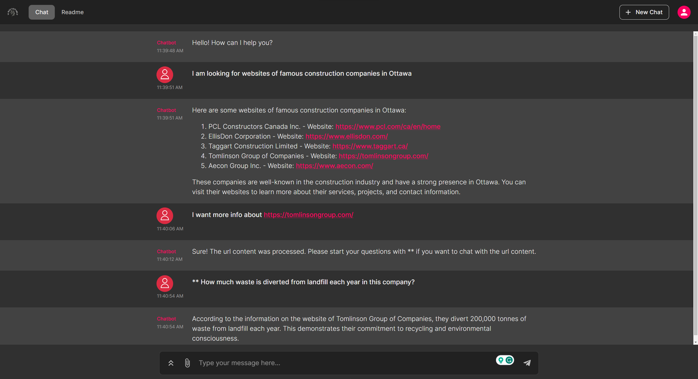
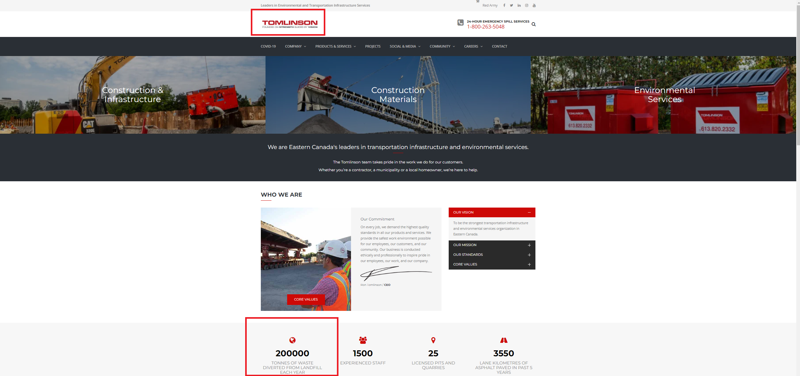
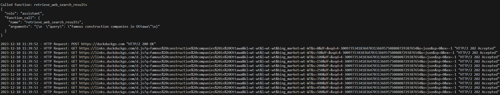
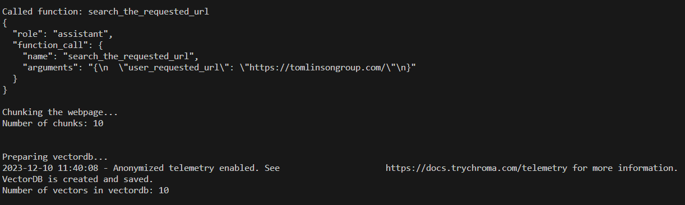
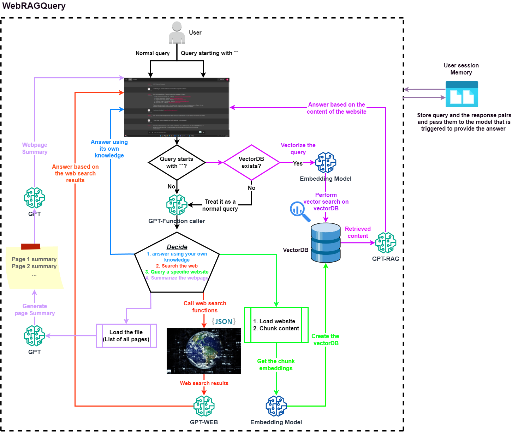

# Web-Summarizer-Chatbot-v0.5

A chatbot built with the OpenAI GPT model in the Chainlit user interface, leveraging GPT agents, function calling, and Retrieval-Augmented Generation (RAG) to enhance conversational capabilities.

## Features

### **1. Normal ChatGPT Interaction**
Engage in natural conversations as with a regular ChatGPT application, ensuring seamless communication.

### **2. Chat with Websites using RAG**
Utilize the **RAG** technique by providing a website link. The chatbot processes the website's content, enabling in-depth discussions and detailed queries.

### **3. Website Summarization**
Request a comprehensive summary of an entire website in a single interaction, streamlining information retrieval.

### **4. Web Search with DocDocGo Integration**
Leverage the chatbot’s connection to the **DocDocGo** search engine for live web searches. Enter a query, and the chatbot retrieves relevant links and information.

## Chainlit User Interface
<div align="center">
  
</div>

## Example Queries and Logs

### **Tomlinson Website Example**
<div align="center">
  
</div>

### **Function Caller Log for First Query**
<div align="center">
  
</div>

### **Function Caller Log for Second Query**
<div align="center">
  
</div>

## Project Schema
<div align="center">
  
</div>

## Running the Project

The project requires setting up the environment and installing dependencies. This can be done using one of the following methods:

### **Option 1: Using the Parent Directory Instructions**
Activate the Python environment and install dependencies:

```
pip install -r requirements.txt
```

### **1. Configuration and Execution**
- Navigate to the `configs` folder and update the `app_config.yml` file if necessary.
- Create a `.env` file in the project folder and add the GPT API credentials.

For **OpenAI**:

```
OPENAI_API_KEY=
```

For **Azure OpenAI**:

```
OPENAI_API_TYPE=
OPENAI_API_VERSION=
OPENAI_API_KEY=
OPENAI_API_BASE=
gpt_deployment_name=
embed_deployment_name=
```

### **2. Activate the Environment**
Ensure the virtual environment is active before running the application.

### **3. Run the Application**
Start the chatbot using the following command:

```
chainlit run src/app.py -h
```

## Automatic Directory Management

The project automatically creates essential directories within the `WebRAGQuery` directory:

1. **`memory`** – Stores essential session data, maintaining a separate CSV file for each session to preserve chat history.
2. **`vectordb`** – Stores **chromaDB** folders, each corresponding to a requested URL. At the start of each session, the folder is regenerated, ensuring a clean slate while purging outdated vectorDBs from previous sessions.

## Sample Prompts

Use the following prompts to trigger different chatbot functionalities:

1. **Prepare a website for RAG:**  
   `Prepare this link for q and a <your desired link>`

2. **Summarize an entire website:**  
   `Summarize this website for me <your desired link>`

3. **Search the web for specific content (e.g., videos):**  
   `I am looking for videos that explain how to train a large language model`

4. **Debug Python code using internal knowledge:**  
   `Debug the following code <your code and the error>`
